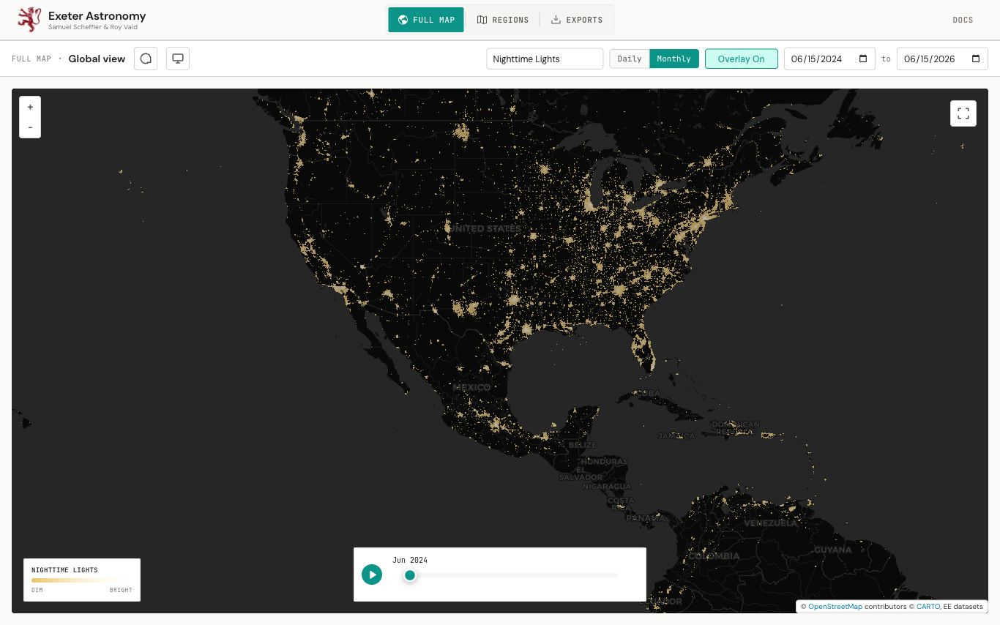
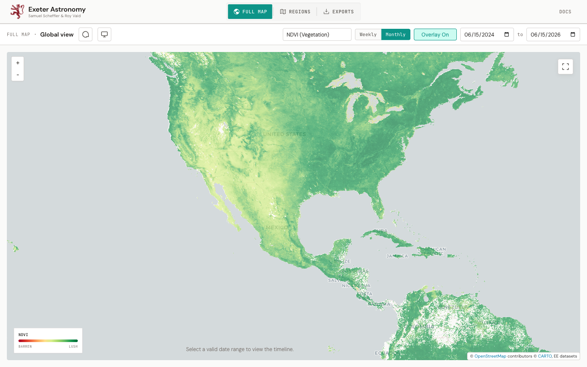
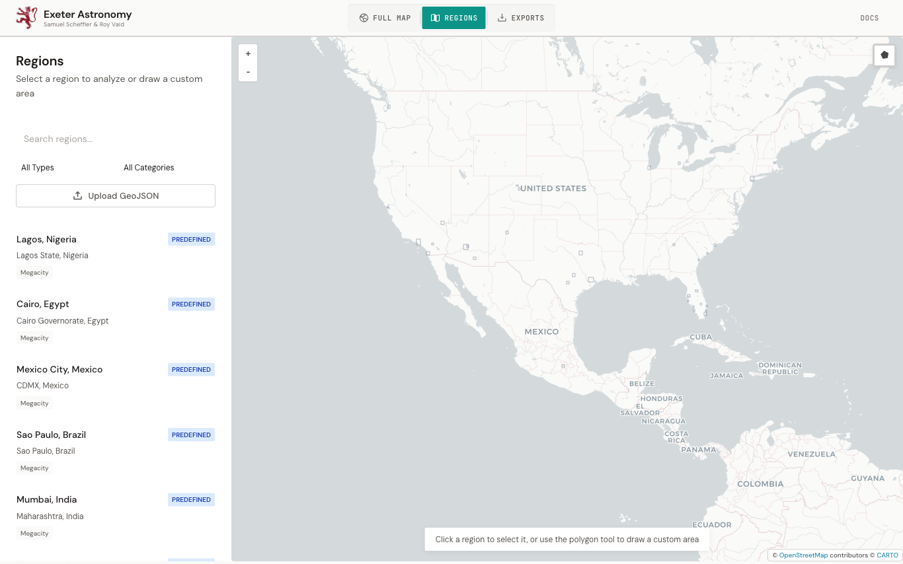

# Exeter Astronomy

We made this for the Exeter Astronomy club. Pick a spot on Earth, pick something you want to see (city lights at night, how green a place is, pollution, temperature, snow, water), and the map shows it. Slide through time and watch it change.

It's live at [geotiles.tech](https://geotiles.tech).

## What you can do with it

Spin the globe and flip on a satellite layer. There are about fifteen of them: vegetation, nighttime lights, surface water, air pollution, temperature, rainfall, cropland, soil moisture, tree cover, forest loss, snow, and more. Green continents, glowing cities, smog over the big metros. It's oddly fun to just poke around.

Jump straight to a city from the preset list, or draw your own shape on the map and the site crunches the numbers for just that area. Want somewhere specific that isn't there? Drop in a GeoJSON file and it shows up.

Scrub the timeline to play a place forward month by month, line up two time periods to see what shifted, and save anything you find as an image, a spreadsheet, or a short animation to share at the next meeting.

## How it works, roughly

All the imagery is free and public, pulled from Google Earth Engine, which does the heavy number crunching and hands back map tiles. On top of that sits a React map and a small Python backend.

## Made by

The Exeter Astronomy club. Roy Vaid and Samuel Scheffler.
